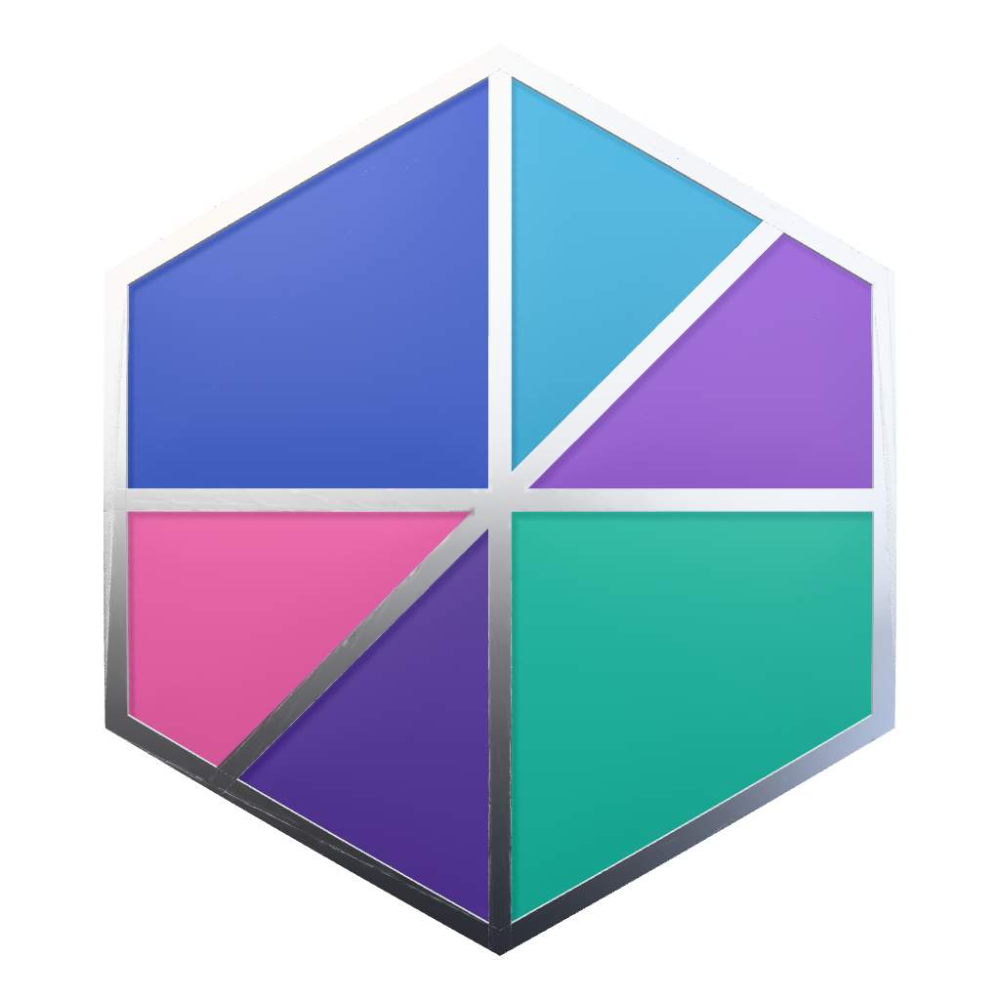
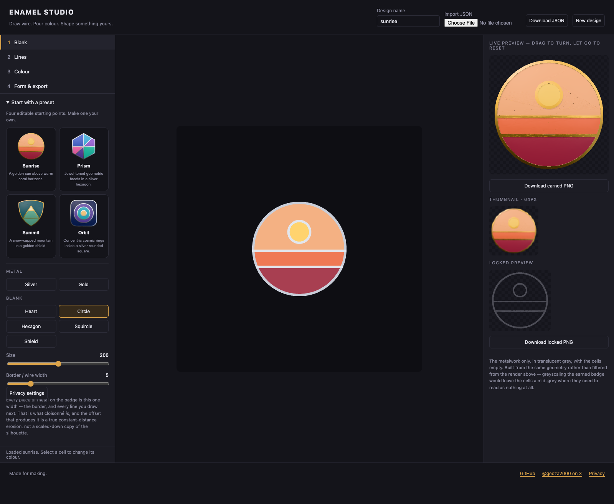
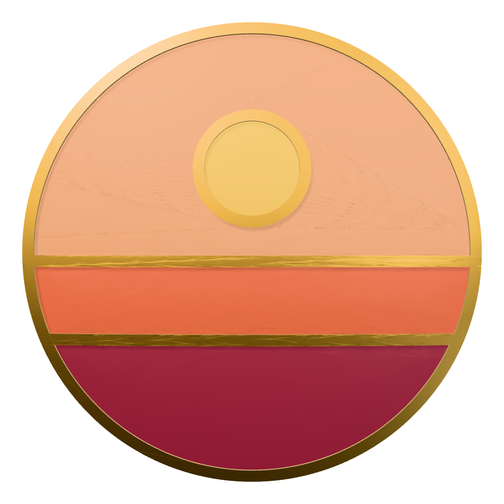
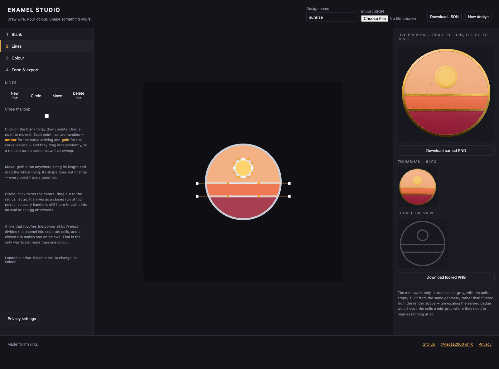
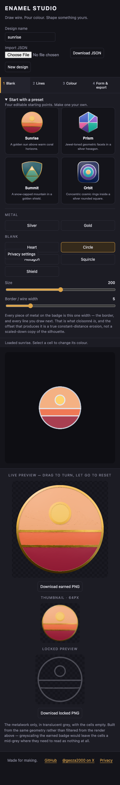

<div align="center">

<a href="https://enamel.geoza.dev"></a>

# Enamel Studio

**Draw wire. Pour colour. Shape something yours.**

A browser-based workshop for 3D enamel badges, medallions, and pins.

Start with a preset, make it yours, and take the files with you.

[**Open the studio ↗**](https://enamel.geoza.dev) · [Quick guide](#quick-guide-make-a-preset-your-own) · [Examples](#presets-and-examples) · [Run locally](#run-locally)

**Browser-native** · **Editable JSON** · **Transparent PNG** · **MIT licensed**

Created by [**@geoza2000**](https://github.com/geoza2000) · [Follow on **X**](https://x.com/geoza2000) · [**GitHub repository**](https://github.com/geoza2000/enamel-studio)

</div>

---

No account, cloud storage, API key, or badge-data backend required. Drawing,
geometry, 3D rendering, imports, and exports happen in your browser.

## Open the studio

**Production:** [enamel.geoza.dev](https://enamel.geoza.dev)

**Firebase fallback:** [enamel-studio-9c5a6.web.app](https://enamel-studio-9c5a6.web.app)

Both URLs serve the same Firebase Hosting release over HTTPS.



## Presets and examples

Open **1 Blank → Start with a preset**, choose a design, and confirm **Replace
with preset**. Every wire, colour, shape, and material stays editable. Loading a
preset replaces the current design; download its JSON first if you want to keep it.

<p>
  
  
  
  
</p>

- **Sunrise** — warm colours and a gold circular frame. [Editable JSON](public/examples/sunrise.json)
- **Prism** — jewel-coloured geometric cells in a silver hexagon. [Editable JSON](public/examples/prism.json)
- **Summit** — a mountain motif in a gold shield. [Editable JSON](public/examples/summit.json)
- **Orbit** — concentric colour regions in a silver rounded-square frame. [Editable JSON](public/examples/orbit.json)

These are original sample designs distributed under this repository's MIT license.
Download a linked JSON file, then select it with **Import JSON** in the studio.
The PNG examples are flattened previews; use JSON to keep the wires editable.

## Quick guide: make a preset your own

1. Load **Sunrise**. The studio opens **3 Colour** with the preset ready to edit.
2. Click a coloured region in the large **2D design canvas**, then choose a swatch
   or **Any colour**. The 3D preview updates automatically.
3. Open **2 Lines** to reshape wires: drag anchors or curve handles. **Move**
   repositions a whole wire; **Circle** draws a closed loop. Finish the geometry
   before final colouring, because changing a cell's shape changes its colour key.
4. Open **4 Form & export** to adjust thickness, cut depth, dish, and roughness.
5. Set **Design name** and choose **Download JSON** for an editable backup.
6. Choose **Download earned PNG** for a transparent 1024 × 1024 image, or
   **Download locked PNG** for the matching unearned outline. PNG exports use
   the standard front view, not a temporarily rotated preview.



<details>
<summary>Mobile layout</summary>



The controls stack above the canvas on narrow screens. Scroll down to the live
preview and PNG export buttons. A desktop pointer is best for fine curve editing.
</details>

### Example workflows

- **Achievement set:** load Prism, change its cell colours for each level, and
  export earned/locked pairs. Keep a separate JSON file for every variation.
- **Custom pin:** load Summit, adjust the mountain's anchors in Lines, then choose
  colours and a metal finish before exporting.
- **Resume later:** download JSON, close the tab, reopen the studio, and import the
  saved document. No account or upload is involved.

## Run locally

Requires Node.js 22.12+ and npm.

```sh
npm ci
npm run dev
```

Open the local address printed by Vite. A browser with WebGL2 is required for
3D previews and image exports. Use a desktop pointer for detailed curve editing;
the controls also adapt to narrow screens.

## Design and export

1. Choose a blank shape, metal, size, and wire width.
2. Draw lines or circles. Drag anchors and curve handles; use Move to reposition
   a whole wire. Close a loop or connect a wire to the border to form cells.
3. Select a cell and choose its enamel colour.
4. Adjust thickness, cut depth, dish, and roughness.
5. Download an editable **JSON document**, a transparent **1024 × 1024 PNG**, or
   the alternate unearned-state PNG. Reopen JSON with the browser file picker.

Files are processed locally in the browser, not uploaded. JSON is data, never
executable JavaScript. PNG is a flattened image, not an editable project format.
Only Enamel Studio version-1 JSON documents are supported; SVG, raster-image,
and JavaScript-module imports are not supported.

**Save before closing or refreshing:** there is no autosave or cloud backup.
Browser downloads are the durable copy of your design. New-design confirmation
protects against accidental resets, but does not replace downloading your work.

## Build and test

```sh
npm test
npx playwright install chromium
npm run test:browser
npm run build
npm run preview
```

`dist/` contains the static site. Serve that directory using any static HTTP
host. The build uses relative asset paths, including for subdirectory hosting.
Do not open `index.html` directly using `file://`. Development tooling is local
only; no development server is needed on a static host.

A GitHub Actions definition is provided as `.github/check.yml.example`. To enable
hosted CI, move it to `.github/workflows/check.yml` and push using credentials
with workflow-write permission. It is not active by default.

## Firebase Hosting

The hosted deployment is pinned to `enamel-studio-9c5a6`. `deployment.json`
contains public project/site and Analytics identifiers, not credentials.

```sh
npm run build:hosting
npm run deploy:hosting
```

Deployment uses the pinned local Firebase CLI, builds the site, and deploys
**Hosting only**. It rejects extra arguments, checks project visibility, ignores
legacy Firebase tokens, and isolates CLI state. Set
`GOOGLE_APPLICATION_CREDENTIALS` to a protected service-account JSON file, or
place a reference at `~/.config/enamel-studio/deployer.json`. Never put credentials
in this repository. The deployer needs Firebase Hosting Admin and Service Usage
Consumer on the target project. Analytics was linked during project setup.
The hosted runtime audit is clean; the pinned deployment CLI currently has
moderate transitive development-only advisories. Avoid blind `npm audit fix --force`.

A plain `npm run build` remains a generic, analytics-free build. Browser tests
use a test measurement ID and intercept consented tag loading. Review the
Analytics property's enhanced-measurement settings before enabling extra events;
do not collect design content or filenames.

## Project layout

- `src/app.mjs`: interactive editor and browser file operations
- `src/document.mjs`: versioned JSON format and input validation
- `src/presets.mjs`: original editable preset definitions
- `public/examples/`: importable preset JSON and rendered PNG examples
- `docs/images/`: real desktop/mobile screenshots used by this guide
- `src/kernel/`: silhouette, polygon geometry, material, and WebGL rendering
- `test/`: document and geometry tests
- `tests/`: real-browser import/download and layout checks
- `public/THIRD_PARTY_NOTICES.txt`: notices distributed with the built site

## Privacy and scope

The generic build includes no analytics unless `VITE_GA_MEASUREMENT_ID` is set.
The Firebase build includes opt-in Google Analytics: no Google tag is loaded
until a visitor chooses **Allow analytics**. **Privacy settings** lets them
withdraw consent. See `public/privacy.html`. There is no login, remote font, or
external asset CDN. The static host can still log ordinary requests for app files. Imported designs stay
in page memory unless you download them. Very complicated wire arrangements can
be slow; the import format deliberately limits document and geometry sizes.
Colour cells after finalizing the wire layout: reshaping a cell changes its
geometry identity and can require assigning its colour again.

## Contributing & staying in touch

Found a bug or have an idea? [Open an issue](https://github.com/geoza2000/enamel-studio/issues).
For development setup and checks, see [CONTRIBUTING.md](CONTRIBUTING.md).
When reporting rendering problems, include your browser and a non-sensitive example
JSON if possible—never private artwork or credentials.

- Follow [@geoza2000 on X](https://x.com/geoza2000) for updates.
- Browse [Enamel Studio on GitHub](https://github.com/geoza2000/enamel-studio),
  fork it, or star it if you find it useful.

## Branding and license

This is an independent enamel-art tool, not an official product of any device,
fitness, or platform vendor. It does not include vendor logos, proprietary
award artwork, or bundled vendor fonts. A metallic/enamel appearance is the
creative direction, not a claim of affiliation or permission to copy artwork.

Use your own designs or assets you have permission to use. The software license
does not grant trademark rights or rights to third-party artwork. Branding and
artwork should be reviewed before a public launch.

Code is available under the [MIT license](LICENSE). Third-party notices are in
[THIRD_PARTY_NOTICES.txt](public/THIRD_PARTY_NOTICES.txt).
